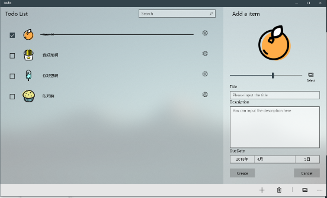
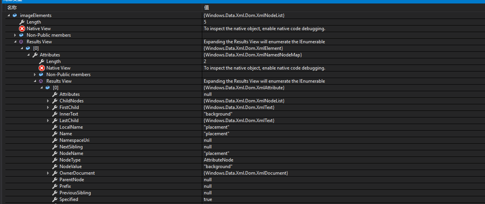
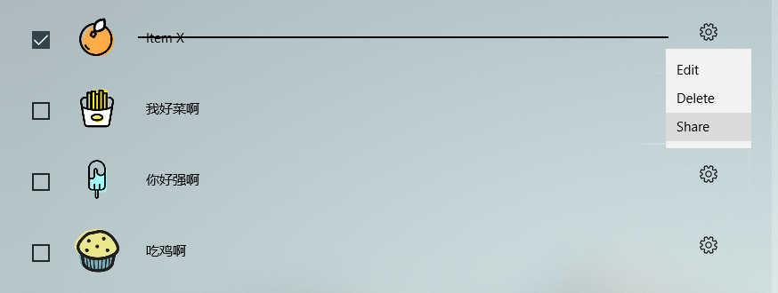
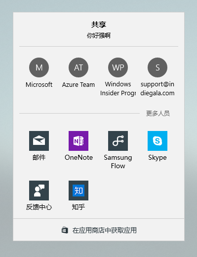
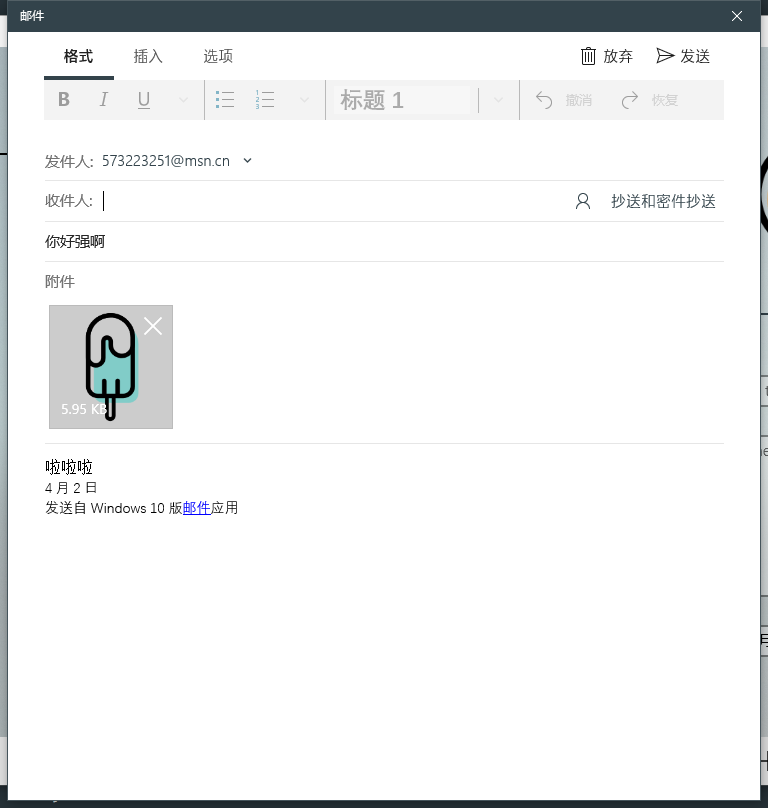
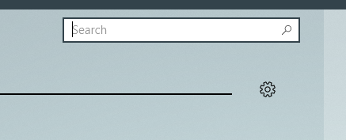
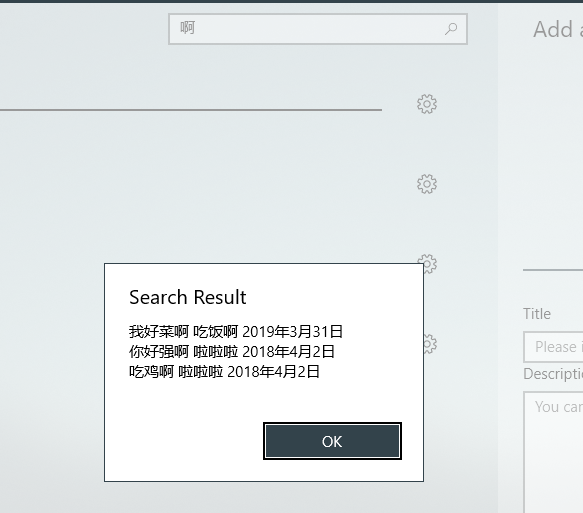
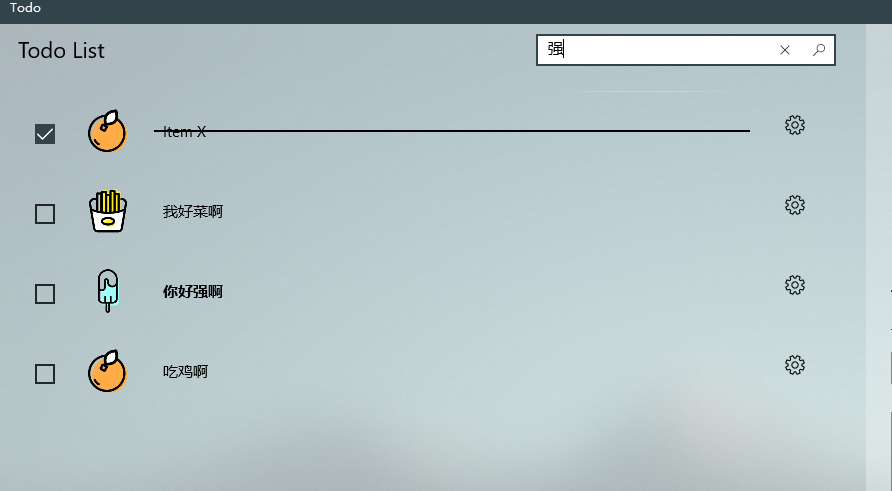
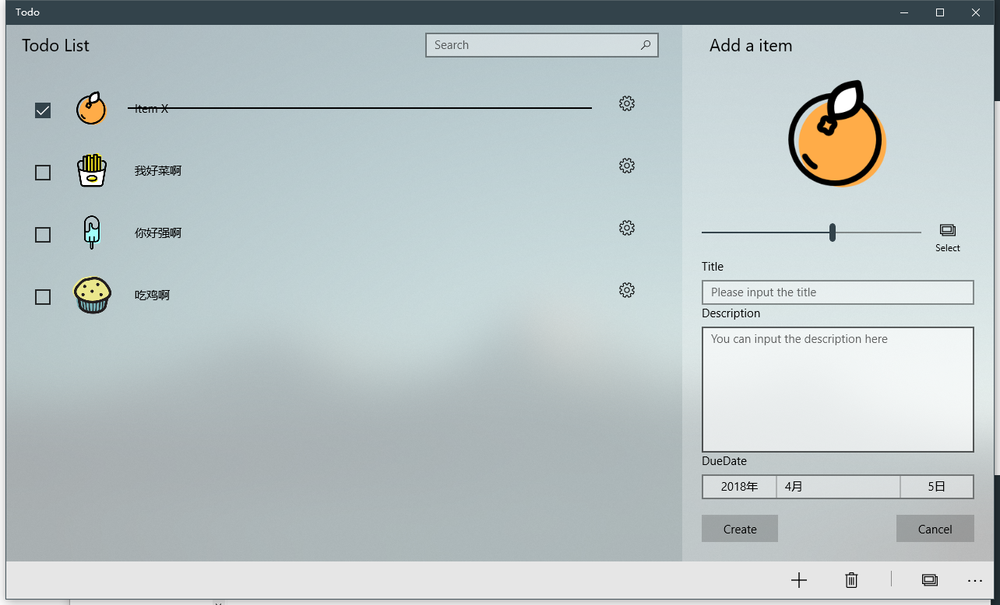

​	这个学期的课程要求开发一个Todo类的UWP应用程序，一路开发过来发现一堆坑，于是把一些重点记录下来。因为应用的大概框架已经成型，基本的功能就不再涉及，这篇文章主要涉及的是一些高级功能开发的一些重点。


*2018/4/7 更新： 随机绑定磁贴图片的操作、即时搜索以及一些个人理解*

*2018/4/15 更新： 动态绑定磁贴图片的操作*

<!--more-->

---

​	首先这一阶段的要求是把程序挂起前的状态保存下来，然后再恢复，不如就一步到位先把数据库搞起来，很多东西就没有必要在做。所以第一步是先引入数据库，这里可以直接使用SQLite相关库直接用SQL语句操作数据库，这个比较简单。我这里想体验一下`EF Core` ， 所以就出现了以下一顿复杂的操作。

## 使用EF Core操作SQLite

​	UWP在 Windows Fall Creators Update SDK 中增加对 .NET Standard 2.0 的支持。因此可以在UWP中使用Entity Framework Core操作SQLite，也可以运用EF Core强大的特性。

​	官网就有很详细的[文档](https://docs.microsoft.com/zh-cn/ef/core/get-started/uwp/getting-started)参考，还有一个[博客](https://www.cnblogs.com/wpinfo/p/uwp_efcore_sqlite.html)也挺值得参考

> 使用前提：
>
> - [Windows 10 Fall Creators Update](https://support.microsoft.com/en-us/help/4027667/windows-update-windows-10) (10.0.16299.0)
> - [.NET Core 2.0.0 SDK](https://www.microsoft.com/net/core) 或更高版本。
> - 具有**通用 Windows 平台开发**工作负载的 [Visual Studio 2017](https://www.visualstudio.com/downloads/) 15.4 版或更高版本。

按照文档中的步骤新建一个模型项目，然后安装两个包

```powershell
Install-Package Microsoft.EntityFrameworkCore.Sqlite
Install-Package Microsoft.EntityFrameworkCore.Tools
```

**注意1：**安装过程中必须要选择模型项目为目标项目，不然会找不到相对应的命名空间

**注意2：**需要修改Model的csproj文件，官方的教程是没有下面那一项的

```xml
 <PropertyGroup>
    <TargetFrameworks>netcoreapp2.0;netstandard2.0</TargetFrameworks>  
    <GenerateRuntimeConfigurationFiles>true</GenerateRuntimeConfigurationFiles>
 </PropertyGroup>
```

注意3：新建模型项目的时候必须要选择Net Standard类库，不然后续步骤无法完成

>由于 .NET Core 工具与 UWP 项目交互的方式受到限制，因此该模型需要放在非 UWP 项目中才能在包管理器控制台中运行迁移命令

注意4:  还有一个比较坑的地方，官网是一带而过的，选择作为默认项目的模型项目并将其设置为启动项目。这个需要到项目属性里面设置(也可以在工具栏里面设置)，不然是无法运行 `Add-Migration MyFirstMigration` 来搭建基架的。执行 Migration 命令，必须使Model 项目为启动项，这是因为目前版本的 EF Core Tools 还不支持 UWP 这种类型的启动项目。([参考](https://stackoverflow.com/questions/48228999/cant-get-ef-sqlite-integration-to-work-in-uwp-application))

注意5：需要在主项目添加引用，才能使用这个类库，而添加引用之前必须要修改Model的csproj为原来的情况。VS是不允许UWP项目应用netcoreapp2.0的东西。你也可以选择在修改之前引用，因为后续的Migration还是可能需要netcoreapp2.0的。

```xml
<TargetFrameworks>netstandard2.0</TargetFrameworks>  
```

注意6: 而且官方的教程是没有为表设置Key的，不设置Key这个是无法迁移的。还有许多关于EFcore一些表的约束可以参考官方文档。但是我看大多数教程都是没有这个Key的，但是我测试是不能成功，并不知道为什么。所以这个还是需要我们自己去设置([参考](https://stackoverflow.com/questions/44666042/entity-framework-core-the-entity-type-xxx-requires-a-primary-key-to-be-define))

```csharp
using System.Collections.Generic;
using System;
using Microsoft.EntityFrameworkCore;
using System.ComponentModel.DataAnnotations;

namespace DataModel
{
    public class DataContext : DbContext {
        public DbSet<ListItem> Items { get; set; }
        protected override void OnConfiguring(DbContextOptionsBuilder optionsBuilder) {
            optionsBuilder.UseSqlite("Data Source=List.db");
        }
    }

    public class ListItem {
        [Key]
        public int ListId { get; set; }
        public string Title { get; set; }
        public string Des { get; set; }
        public Boolean IsCheck { get; set; }
        public DateTimeOffset DueDate { get; set; }
        public byte[] Icon { get; set; }
    }
}

```

如果更新了Model文件，那就需要再次Add-Migration， 需要设置启动项目和默认项目为Model项目才能运行。

**注意7：** Add-Migration 后面接的名字不能为`Migration`， 不然会发生异常

**注意8：** Add-Migration 的时候另一个项目必须是没有错误的，不然的话会Build Failed


然后我们就可以在本来的工程里面使用数据库了。

在`App.xmal.cs`里面

```csharp
public App() {
    this.InitializeComponent();
    this.Suspending += OnSuspending;

    // 在应用加载的时候初始化数据库
    using (var db = new DataModel.DataContext()) {
        db.Database.Migrate();
    }
}
```

然后在其他任何地方都可以调用了。

具体的**增删改**官方文档里面就写得非常详细了。（[参考](https://docs.microsoft.com/zh-cn/ef/core/querying/basic)）

在具体使用的时候还是遇到了一些坑：

**注意9：** 如果从一个空白的数据库使用Single或First方法，会导致严重错误导致整个VS都会崩溃（我也很绝望。因此，需要使用`FirstOrDefault()`和`SingleOrDefault()`， 当数据库为空的时候会返回`Null`。（[参考](https://stackoverflow.com/questions/1324199/sequence-contains-no-elements)）

**注意10：** 我尝试在`Model`的`DataContext`里面定义了两个不同名字但是同一类型的`DbSet`， 但是很惊奇地发现这两个不同的名字只是同一个数据库的引用。很刺激，也不知道为什么。因此只好定义了两个不同数据类型的`DbSet` 。

不得不说，在`UWP`中使用`EF Core` 真的是十分多坑，如果只是简单做做还是直接用`SQL`语句比较快。🚀

在我的项目里面还有一点不太满意的地方，就是数据`Model`与`ViewModel`并没有分离开来，导致数据库与视图的耦合度非常地高，我也考虑过分离开来，但是这样一来操作数据的时候就需要做两次操作。有空还是需要重构一下数据模型这一部分的代码，设计一个更好的架构，或者参考一下别人的框架是如何实现的。现在的架构实在是不太优雅，但是最近比较忙，也没有空去搞了。😔


## 图片数据的保存

保存图片有不少方案，比如可以保存图片所在路径（可能需要获取相关权限并保存），也可以复制所选图片到UWP所可以访问的目录，而数据库就存他的路径（也可以使得图片根据数据库记录ID来命名）。第一个方法非常不保险，因为图片的路径可能会发生改变，那么重启应用之后就不能访问了，而第二种方法是可行的，但是我这里用了第三种方法，就是把图片数据存在数据库里面。	

第二种方法和第三种方法之间有什么优劣，这个就关系到接下来的操作。

如果你使用的是第二种方法，那么对于磁贴动态绑定图标就非常方便，只需要简单修改磁贴XML的`src`路径，但是在分享的时候，动态绑定图片就需要先把图片读取出来并转化为`Stream`（其实还不算麻烦）。

如果你使用第三种方法，那么就方便与分享的动态绑定，而磁贴的动态绑定则需要先把图片数据保存为文件（这个管理起来就有点麻烦），再去修改`src`。

当然，如果你有更好的方法欢迎在下面评论区讨论。

由于图片数据是不能直接放在数据库里面的，所以需要把图片转换为`byte[]`类型。于是`google`了两个函数。他们都是使用`Stream`来把`BitmapImage`转换为 `byte[]`的。

```csharp
public class UtilTool {
    public static async Task<BitmapImage> ConvertByteToImage(byte[] imageBytes) {
        if (imageBytes != null) {
            MemoryStream stream = new MemoryStream(imageBytes);
            var randomAccessStream = new MemoryRandomAccessStream(stream);
            BitmapImage bitmapImage = new BitmapImage();
            await bitmapImage.SetSourceAsync(randomAccessStream);
            return bitmapImage;
        } else {
            return new BitmapImage(new Uri("ms-appx:///Assets/itemIcon.jpg")); // 默认图片
        }
    }

    public static async Task<byte[]> ConvertImageToByte(StorageFile file) {
        using (var inputStream = await file.OpenSequentialReadAsync()) {
            var readStream = inputStream.AsStreamForRead();
            var byteArray = new byte[readStream.Length];
            await readStream.ReadAsync(byteArray, 0, byteArray.Length);
            return byteArray;
        }
    }
}


class MemoryRandomAccessStream : IRandomAccessStream {
    private Stream m_InternalStream;

    public MemoryRandomAccessStream(Stream stream) {
        this.m_InternalStream = stream;
    }

    public MemoryRandomAccessStream(byte[] bytes) {
        this.m_InternalStream = new MemoryStream(bytes);
    }

    public IInputStream GetInputStreamAt(ulong position) {
        this.m_InternalStream.Seek((long)position, SeekOrigin.Begin);

        return this.m_InternalStream.AsInputStream();
    }

    public IOutputStream GetOutputStreamAt(ulong position) {
        this.m_InternalStream.Seek((long)position, SeekOrigin.Begin);

        return this.m_InternalStream.AsOutputStream();
    }

    public ulong Size {
        get { return (ulong)this.m_InternalStream.Length; }
        set { this.m_InternalStream.SetLength((long)value); }
    }

    public bool CanRead {
        get { return true; }
    }

    public bool CanWrite {
        get { return true; }
    }

    public IRandomAccessStream CloneStream() {
        throw new NotSupportedException();
    }

    public ulong Position {
        get { return (ulong)this.m_InternalStream.Position; }
    }

    public void Seek(ulong position) {
        this.m_InternalStream.Seek((long)position, 0);
    }

    public void Dispose() {
        this.m_InternalStream.Dispose();
    }

    public Windows.Foundation.IAsyncOperationWithProgress<IBuffer, uint> ReadAsync(IBuffer buffer, uint count, InputStreamOptions options) {
        var inputStream = this.GetInputStreamAt(0);
        return inputStream.ReadAsync(buffer, count, options);
    }

    public Windows.Foundation.IAsyncOperation<bool> FlushAsync() {
        var outputStream = this.GetOutputStreamAt(0);
        return outputStream.FlushAsync();
    }

    public Windows.Foundation.IAsyncOperationWithProgress<uint, uint> WriteAsync(IBuffer buffer) {
        var outputStream = this.GetOutputStreamAt(0);
        return outputStream.WriteAsync(buffer);
    }
}
```

这两种方法都涉及到`async/await` 因此需要考虑到一些异步问题。

我在这里就遇到了一个问题。当应用从挂起状态恢复时候，List还没有渲染完成，但是数据恢复已经开始执行，因此会造成了List的`SelectedIndex` 越界问题。这个就很烦，不能恢复选中的项目。这里先放下来，以后再去研究下解决方案。


## 挂起后状态的保存

在`App.xmal.cs`里面修改`OnSuspending` 函数， 加入当整个应用挂起后所做的操作。这里用到了`ApplicationData.Current.LocalSettings` ， 这个是一个键-对的结构类型，可以用于存储一些数据量比较少的状态，因为他是有大小限制的，最多存储一些字符串。

```csharp
private void OnSuspending(object sender, SuspendingEventArgs e) {
    var deferral = e.SuspendingOperation.GetDeferral();
    //TODO: 保存应用程序状态并停止任何后台活动
    Frame frame = Window.Current.Content as Frame;
    ApplicationData.Current.LocalSettings.Values["NavigationState"] = frame.GetNavigationState();
    deferral.Complete();
}
```

 在`App.xmal.cs` 里面修改`OnLaunched` 函数，当程序加载时候做的操作

```csharp
if (e.PreviousExecutionState == ApplicationExecutionState.Terminated) {
    //TODO: 从之前挂起的应用程序加载状态
    if (ApplicationData.Current.LocalSettings.Values.ContainsKey("NavigationState")) {       					rootFrame.SetNavigationState(
        	(string)ApplicationData.Current.LocalSettings.Values["NavigationState"]);
    }
}
```

当然，我一开始就部署好了数据库，我们现在就可以通过数据库保存状态。

对于页面的状态，我们可以通过override一些函数，自定义页面加载时和关闭时的操作

```csharp
protected override void OnNavigatedTo(NavigationEventArgs e) {
    base.OnNavigatedTo(e);
    if (e.NavigationMode == NavigationMode.Back) { // 判断页面是否时挂起后重新加载
        using (var db = new DataModel.DataContext()) {
            var tempItem = db.State.FirstOrDefault();
            if (tempItem != null) {
                // 从数据库加载数据
            }
        }
    }
}

protected override void OnNavigatedFrom(NavigationEventArgs e) {
    base.OnNavigatedFrom(e);
    // 保存当前状态
}

```


## 磁贴的操作

[官方文档](https://docs.microsoft.com/zh-cn/windows/uwp/design/shell/tiles-and-notifications/index)

[一个还可以的博客](http://www.cnblogs.com/tcjiaan/p/4696194.html)

这里要求我们使用XML的形式开发磁贴，所以首先下载官方文档提供的一个[制作器](https://docs.microsoft.com/zh-cn/windows/uwp/design/shell/tiles-and-notifications/notifications-visualizer)， 可视化制作磁贴。

我们可以参考里面的例子设计出自己的样式。

这个就比较简单了，设计完导出xml。

我这里设计了三个不同大小的Tile， 那个最小的我认为没有必要就不搞了


新建一个`Tile.xml` ， 内容为我们设计的xml。

然后显示我们所设计的磁贴，下面是一个简单的例子。

```csharp
public static void AddTile(string title, string des, DateTimeOffset date) {
    String strDate = date.ToString("M");
    // 加载xml文档
    XmlDocument document = new XmlDocument();
    document.LoadXml(System.IO.File.ReadAllText("Tile/Tile.xml"));
    XmlNodeList textElements = document.GetElementsByTagName("text");
    foreach(var text in textElements) {
        // 替换里面预设的字符串
        if (text.InnerText.Equals("title")) {
            text.InnerText = title;
        } else if (text.InnerText.Equals("des")) {
            text.InnerText = des;
        } else if (text.InnerText.Equals("date")) {
            text.InnerText = strDate;
        }
    }
    // Then create the tile notification
    var notification = new TileNotification(document);
    TileUpdateManager.CreateTileUpdaterForApplication().Update(notification);
}
```

这里有一个**坑**，对于`XmlDocument` ，它有两个命名空间都是有这个类型的，按`Alt + Enter` 引入的第一个命名空间并不是接下来所需要的，会得到类型错误的提示，我们需要引用另一个命名空间。

接下来需要循环显示, 这个比较简单，一句话就可以。

```csharp
TileUpdateManager.CreateTileUpdaterForApplication().EnableNotificationQueue(true);
```

这个是一个FIFO的Queue, 据说最多可以有5个瓷砖循环。

<del>比较遗憾的是没有研究出如何绑定图片。</del>

今天又研究了一下，根据断点调试输出的变量，研究了一下得到的`XMLNode`的结构， 写出了两个设置和改变节点属性的函数。

```csharp
private static string GetAttriByName(IXmlNode nodes, string name) {
    foreach(var attri in nodes.Attributes) {
        if (attri.NodeName.Equals(name)) {
            return attri.InnerText;
        }
    }
    return null;
}

private static void SetAttriByName(IXmlNode nodes, string name, string text) {
    foreach (var attri in nodes.Attributes) {
        if (attri.NodeName.Equals(name)) {
            attri.NodeValue = text;
            break;
        }
    }
}
```

但是我的图片都是以`byte[]`类型存在数据库里面的，因此如果要动态绑定到Tile上，还需要重新保存在本地，还是比较麻烦，因此只好使用了一些预先存在`Assert`文件夹里面的一些图片。

```csharp
XmlNodeList imageElements = document.GetElementsByTagName("image");
foreach(var image in imageElements) {
    string name = GetAttriByName(image, "name");
    if (name != null && name.Equals("icon")) {
        SetAttriByName(image, "src", GetIcon());
    }
}
```

更新： 动态绑定项目的图片的主要难点在于如何有效管理和生成本地图片，因为目前我只发现绑定本地图片路径的方法。首先这个图片必须是应用有权限访问的，因此我把它存在本地目录下。下面这个参数可以将图片的`byte[]` 转换为本地文件

```csharp
private static async Task<StorageFile> AsStorageFile(byte[] byteArray, string fileName) {
    StorageFolder storageFolder = ApplicationData.Current.LocalFolder;
    StorageFile sampleFile = await storageFolder.CreateFileAsync(fileName, CreationCollisionOption.ReplaceExisting);
    await FileIO.WriteBytesAsync(sampleFile, byteArray);
    return sampleFile;
}
```

然后管理方案我使用了循环数的方法，这是一个非常简陋的方法，一方面考虑到不能占用太多空间，时间戳大概是不行的，因为你很难清理以前的图片，其实还可以使用这个项目的唯一id标识，不过清理起来还是有点麻烦。这里使用循环数字可以自动覆盖掉之前的图片，始终占用不超过指定的图片数。因为磁贴队列最多也是5个。

```csharp
private static int count = 0;

private static string GetCount() {
    count++;
    if (count > 8) count = 0;
    return $"icon-{count}.png";
}
```

然后就可以动态绑定图片进去里面了。

```csharp

string path = "Assets/orange.png";
if (icon != null) {
    path = GetCount();
    path = (await AsStorageFile(icon, path)).Path;
}
foreach(var image in imageElements) {
    string name = GetAttriByName(image, "name");
    if (name != null && name.Equals("icon")) {
        SetAttriByName(image, "src", path);
    }
}
```

不过比较遗憾的是，每次操作都要重新生成5张或以上的图片，性能的代价比较大。如果使用记录的ID管理起来应该就比较方便了，最好还是生成图片的Hash，可以判断是否存在再生成。


## 分享功能

首先在list右边加一个button

```xml
<AppBarButton x:Name="SettingButton"
              RelativePanel.AlignVerticalCenterWithPanel="True"
              RelativePanel.AlignRightWithPanel="True"
              Icon="Setting">
    <AppBarButton.Flyout>
        <MenuFlyout>
            <MenuFlyoutItem Text="Edit" Click="MenuEdit_Click"/>
            <MenuFlyoutItem Text="Delete" Click="MenuDelete_Click"/>
            <MenuFlyoutItem Text="Share" Click="MenuShare_Click"/>
        </MenuFlyout>
    </AppBarButton.Flyout>
</AppBarButton>
```



共享功能主要参考这篇[文档](https://docs.microsoft.com/en-us/windows/uwp/app-to-app/share-data)

然后主要代码如下：

```csharp
// 当前分享的内容
private Item currentItem;

// 点击分享事件
private void MenuShare_Click(object sender, RoutedEventArgs e) {
    DataTransferManager dataTransferManager = DataTransferManager.GetForCurrentView();
    var originalSource = e.OriginalSource as MenuFlyoutItem;
    Item data = (Item)originalSource.DataContext;
    currentItem = data;
    dataTransferManager.DataRequested += DataRequested;
    DataTransferManager.ShowShareUI();
}

// 用于转换类型
internal static async Task<InMemoryRandomAccessStream> ConvertTo(byte[] arr) {
    InMemoryRandomAccessStream randomAccessStream = new InMemoryRandomAccessStream();
    await randomAccessStream.WriteAsync(arr.AsBuffer());
    randomAccessStream.Seek(0); 
    return randomAccessStream;
}

private async void DataRequested(DataTransferManager sender, DataRequestedEventArgs e) {
    DataRequest request = e.Request;
    // 设置分享标题
    request.Data.Properties.Title = currentItem.Title;
    
    // 将图片uri或者byte转换成可以分享的类型
    RandomAccessStreamReference bitmap;
    if (currentItem.ImageByte != null) {
        InMemoryRandomAccessStream stream = await ConvertTo(currentItem.ImageByte);
        bitmap = RandomAccessStreamReference.CreateFromStream(stream);
    } else {
        bitmap = RandomAccessStreamReference.CreateFromUri(new Uri("ms-appx:///Assets/orange.png"));
    }
    // 设置分享的图片
    request.Data.SetBitmap(bitmap);
    // 设置分享的内容
    request.Data.SetText(currentItem.Des + "\n" +currentItem.DueDate.ToString("M"));
}
```

`ConvertTo`可以将保存将`byte`数据转换成`InMemoryRandomAccessStream` , 然后可以**动态分享图片**了。是不是很简单呢。





## 搜索功能

在`xmal`里面， 使用了`AutoSuggestBox` 这个强大的控件，如果再添加几个事件还可以实现实时查找。

[参考文档](https://docs.microsoft.com/en-us/windows/uwp/design/controls-and-patterns/auto-suggest-box)

```xml
<AutoSuggestBox PlaceholderText="Search" QueryIcon="Find" Width="300"
                HorizontalAlignment="Right" Margin="0,10,30,0" QuerySubmitted="QueryItem"/>  
```



至于搜索的功能简单地运用SQL就可以完成。

当然，我这里使用了EF Core， 因此可以使用`LINQ` 很方便地进行数据库操作。

```csharp
private void QueryItem(AutoSuggestBox sender, AutoSuggestBoxQuerySubmittedEventArgs args) {
    var text = args.QueryText;
    using (var db = new DataModel.DataContext()) {
        var items = db.Items.Where(b => b.Title.Contains(text) || 
                                   b.Des.Contains(text) || 
                                   b.DueDate.ToString("D").Contains(text)).ToList();
        string content = "";
        foreach(var item in items) {
            content += $"{item.Title} {item.Des} {item.DueDate.ToString("D")}\n";
        }
        if (content.Equals("")) {
            content = "No Result";
        }
        UtilTool.SendADialog("Search Result", content);
    }
}
```




然后添加一下`TextChange`事件还能实现即时搜索。

```csharp
private void TextChanged(AutoSuggestBox sender, AutoSuggestBoxTextChangedEventArgs args) {
    var text = sender.Text;
    foreach (var item in ItemsDataSource.GetData().Source) {
        if (text.Equals("")) {
            item.Font = FontWeights.Normal;
            continue;
        }
        if (item.Title.Contains(text) ||
            item.Des.Contains(text) ||
            item.DueDate.ToString("D").Contains(text)) {
            item.Font = FontWeights.Bold;
        } else {
            item.Font = FontWeights.Normal;
        }
    }
}
```



然后，这样这周的要求就基本实现了。

最后的效果图



