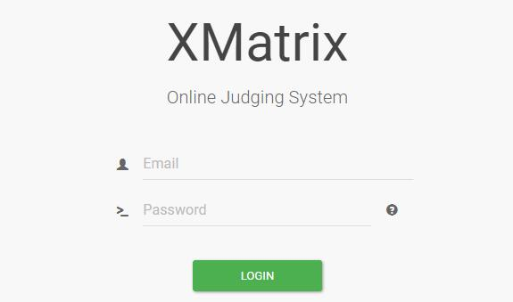
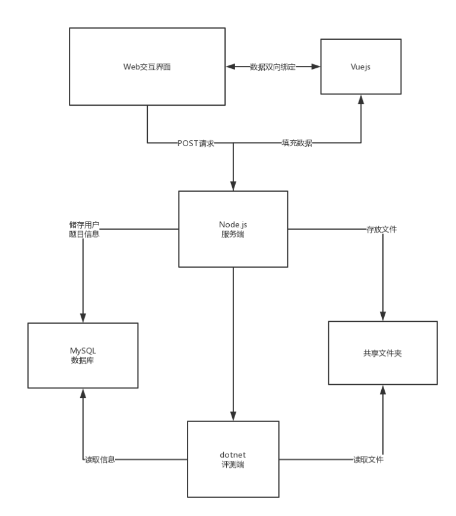

 0.1的森林猫已经具有基本的评测功能了，我们又开始开发了0.2的布偶猫。

<!--more-->

 由于一开始不懂得用各种高级功能和对于nodejs的语法不甚了解，导致代码写得很蠢。布偶猫对前一个版本的代码进行的完全的重构，起码有70%的代码的结构经过了修改，而且总的代码量减少了至少30%以上。

 这个版本，引入了vuejs对前端页面进行了重构，提高了页面代码的可读性和各个部分的可操作性。vuejs可以对数据进行双向绑定，还有v-for等功能非常适合与大量重复框架的内容的展示。数据的双向绑定使得页面形成之后对于页面内容的修改变得非常的方便，只要修改指定对象的数据页面就会更新发生变化，所以我把问题列表和问题详情这两个页面用vuejs重新写了一次，页面从服务器得到数据之后就不需要一个个操作DOM来修改页面内容。对于以后的进一步开发提供了便利

 其次，为了赶上技术潮流，我把网站的协议由http1.1升级为http2，网上有人测试过，http2的性能可以达到http1.1的5-10倍甚至更高。但是要用上http2也是不简单的，至今我还没有实现在我的chrome上使用h2和xmatrix连接。首先我启用了nginx的http2模块，但是这个并没有用，然后查阅资料才发现是由于nginx的openssl版本太低而导致的，只有openssl1.0.2以上的版本才支持ALPN，否则只能支持NPN，而chrome在上一年的6月的更新里就只不允许NPN使用h2连接，会自动降级到http1.1，然后我发现我的centos的openssl居然是2013年的老版本，（据说14年ssl爆出心脏出血漏洞涉及到全球大多数设备），于是我重新编译安装了2017年的openssl，然后再对nginx编译升级到1.13.0的主线版本，然而还是不能在我的浏览器启用h2，也不知道为什么。

 在上面搜索资料的过程中，我发现了一个检测网站连接安全性的网站，惊讶地发现xmatrix的安全型只有F，然后我修改了nginx的配置文件，使用了更加安全的策略，禁止不安全的算法，然后就安全性提升到A+了。

在这个版本里面，我把nodejs变得更加的模块化了，把一些操作封装成了一个对象，比如数据库模块，用户认证模块，页面渲染模块，让主要的express的app.js只负责数据的中转，变成一个中间层。下一步的目标就是把邮件系统也封装起来。现在app.js这个主要的服务进程实现了比0.1更多的功能，代码量却减少了30%。我个人认为，模块化应该是很重要的一个环节，因为把代码都写在一个文件里面是一个很灾难的东西，极大地降低的代码的可读性。如果以后要做分布式的话，可以考虑构造一套以http协议为api的子系统，这也是很久之前的构想了。

然后，对于问题详情页面的渲染，我一开始采用了ejs的模板引擎。问题列表是使用静态页面通过post请求获得内容，使用vuejs进行渲染，而问题详情页面是服务器首先把数据填充好，再发给用户端用vuejs进行渲染。为什么要这样做，主要是因为权限的管理。问题列表的获取在本来的设计上是不需要用户权限，也就是说并不需要登陆就可以访问的，而问题详情页面里面包含这大量的用户信息，必须要登陆才可以进行访问。这样的一个设计是考虑到给未登录的用户足够大的权限，但是又不允许未登录的用户越权访问。这样一来，用户在访问问题详情页面的时候就要先向服务器进行请求，服务器验证了用户的身份再从数据库读取信息，填充到页面里面去。但是后期或许会考虑去掉这个ejs模板引擎直接通过post发送数据交给vuejs，因为这个前天上手了这个前端框架发现还真功能强大，的确足够替代掉ejs，又能保证代码功能实现的一致性，还有vuejs的路由功能确实应该要用上。

至于评测端，就是由另一位大佬来写的。我也只是了解调用的过程。目前调用评测是通过nodejs调用子进程来实现的，并没有轮询。首先，由nodejs把用户和问题的的数据存到数据库，还有把代码以uid和pid的命名格式存到本地，然后调用judge进程，把用户和问题id作为参数传进去，然后评测系统就对代码进行评测，评测完就把结果写进数据库。同一时间，用户在提交代码以后就会每隔一段时间向服务器请求成绩数据，服务端就会查询数据库，如果评测好了就会返回成绩。现在的评测端只是支持编译测试和标准测试，还有很多的工作需要去做

关于接下来的开发关注点应该就是在docker的实现，现在评测服务的运行还是在整个服务器本地上跑的，这是一个极大的安全隐患，一个恶意代码就有可能把服务器搞崩，如果实现了docker，那么nodejs也应该要放进去docker里面了，全部实现docker化

对于服务端的代码，我是有考虑后期用ES6再重构一次的，但是也要等我学会了ES6的基本语法再说。

这个项目的一个重大的缺陷就在于没有完善的项目管理，现在的需求，开发，测试，全都是手工操作，没有一套规定的流程，所以这个版本我们即将引入Teambition团队管理攻击以及文档管理（还没选好用什么），规范一下项目开发流程。

目前的大致框架

